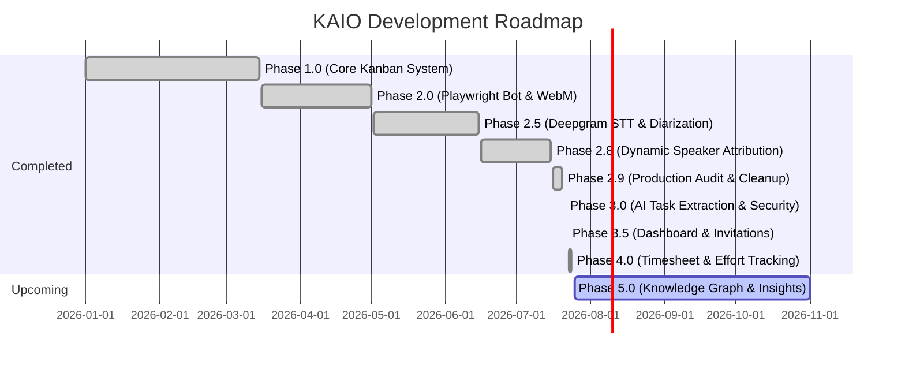

# 01 — Project Overview

## 1. Executive Summary & Vision

**KAIO** (Kanban AI Orchestration) is an enterprise-grade, AI-native meeting intelligence and task orchestration platform. It automatically converts live video meetings into structured, actionable task boards with real-time speaker attribution, transcript resolution, and automated task extraction.

```
┌─────────────────┐       ┌─────────────────┐       ┌─────────────────┐       ┌─────────────────┐
│   Google Meet   │  ───► │  Playwright Bot │  ───► │ Deepgram Engine │  ───► │ Task Board UI   │
│ Live Meeting    │       │ Audio & Presence│       │ STT + Diarize   │       │ Speaker Aligned │
└─────────────────┘       └─────────────────┘       └─────────────────┘       └─────────────────┘
```

---

## 2. Core Value Proposition & Unique Selling Proposition (USP)

Unlike traditional meeting recording tools that generate static videos or raw transcripts without owner attribution, KAIO provides:

1. **Zero-Touch Automated Joining & Capture**: Playwright bot joins scheduled Google Meet links, streaming tab audio directly into non-lossy WebM buffers while concurrently observing participant presence.
2. **Real-time Chrome Extension Integration**: Manifest V3 extension tracks participant arrivals, departures, mute toggles, and display name changes, giving the backend a deterministic timeline of present attendees.
3. **Atomic Speech & Diarization**: Leverages Deepgram Nova-3 API for simultaneous, multi-speaker word-level transcription and timestamped speaker diarization.
4. **Dynamic Speaker Attribution**: Merges presence timelines with audio timestamps using a weighted score heuristic (Presence overlapping, turn affinity, roster confidence) to produce `participant_attributed_transcript.json`.
5. **Strict Database Architecture**: PostgreSQL database powered entirely by canonical views (`v_*_canonical`) and stored procedures, guaranteeing zero raw SQL query leaks in backend code.
6. **Manager/Superadmin Dashboard**: Aggregated org-wide KPI metrics, per-board progress summaries, and recent activity feed gated behind RBAC.
7. **Invitation Lifecycle Management**: Full workspace invitation system — send, list, verify, accept, and revoke pending invitations.
8. **Enterprise Timesheet Management**: Comprehensive weekly effort logging against boards/tasks, customizable organization policies, manager approval queues, audit trails, and reporting views.

---

## 3. High-Level Architecture Diagram

```mermaid
graph TD
    subgraph Client Layer
        FE[React 19 SPA / Vite]
        EXT[Chrome Extension MV3]
    end

    subgraph API Gateway & Core Backend
        API[FastAPI Gateway /api/v1]
        AUTH[Auth Service / httpOnly Cookie JWT]
        BOARD[Board & Task Service]
        DASH[Dashboard Service]
        INV[Invitation Service]
        TS[Timesheet Engine & Approval Queue]
    end

    subgraph Meeting Subsystem
        MS[Meeting Service / Manager]
        BOT[Playwright Bot Controller]
        REC[MediaRecorder Script]
        PIPE[Meeting Pipeline Orchestrator]
    end

    subgraph AI & External Services
        DG[Deepgram Nova-3 API]
        LLM[Puter / Gemini Provider]
        KAI[KAI Board Assistant Agent]
    end

    subgraph Data Store
        DB[(PostgreSQL Database)]
        STORAGE[(Local Disk File Storage)]
    end

    FE <──► API
    EXT ──►|Presence Events| API
    API ──► AUTH
    API ──► BOARD
    API ──► MS
    API ──► DASH
    API ──► INV
    API ──► TS
    API ──► KAI
    MS ──► BOT
    BOT ──► REC
    REC ──►|WebM Output| STORAGE
    MS ──► PIPE
    PIPE ──► STORAGE
    PIPE ──► DG
    PIPE ──► LLM
    BOARD ──►|Canonical Views & Stored Procs| DB
    AUTH ──►|Stored Procedures| DB
    DASH ──►|Canonical Views| DB
    TS ──►|Timesheet Canonical Views & Procs| DB
```

---

## 4. Major Sub-systems Overview

### 4.1 Backend Engine (`backend/app`)
- Built with **Python 3.12+** and **FastAPI**.
- Uses `asyncpg` connection pooling for non-blocking database operations.
- **21 REST API routers** covering auth, boards, tasks, comments, attachments, notifications, activity, board members, admin, invitations, my-work, preferences, organization, AI, task proposals, dashboard, users, timesheets, timesheet approvals, timesheet admin, and the meeting subsystem.
- Enforces a strict architectural constraint: **NO raw SQL in backend Python services**. All reads use `v_*_canonical` views, and writes call PostgreSQL stored functions.
- Authentication uses **httpOnly cookie-based JWT** — `access_token` (15 min) and `refresh_token` (7 days) set as server-side cookies; no tokens are exposed in response bodies.

### 4.2 Meeting Pipeline (`backend/app/meeting`)
- Post-processing orchestrator managing stage-based pipeline execution.
- Managed by `MeetingService` and `SessionManager`.
- Bot automation using Playwright Chromium with non-interactive headless profiles.

### 4.3 Database Engine (`database/`)
- Pure PostgreSQL schema managed via **47 versioned migration scripts** (`001_*.sql` → `047_fix_rejected_timesheet_status.sql`).
- Custom functions for authorization, mutations, triggers, security events, user session management, task proposal approval queues, dashboard KPI views, invitation lifecycle, timesheet grid & approvals, and canonical views.
- Rebuild script: `database/scripts/rebuild.py` — supports incremental apply (`python rebuild.py`) or full reset (`python rebuild.py --reset`).

### 4.4 Frontend SPA (`frontend/`)
- Built with **React 19**, **TypeScript**, **Vite**, and **Tailwind CSS v4**.
- State managed via **Zustand** stores (10 stores: `authStore`, `boardStore`, `taskStore`, `adminStore`, `notificationStore`, `organizationStore`, `preferencesStore`, `projectSettingsStore`, `activityStore`, `uiStore`).
- **13 Feature Modules** (`activity`, `admin`, `ai`, `auth`, `boards`, `dashboard`, `meeting`, `my-work`, `notifications`, `projects`, `proposals`, `settings`, `timesheets`).
- Drag-and-drop powered by **@dnd-kit** (core + sortable).
- Route guards: `ProtectedRoute` (auth check) and `RequireRole` (RBAC role check).
- Interactive notifications with destination deep-linking, multi-device session management UI, task proposal review queues, and weekly timesheet effort logging grid with manager review modals.

### 4.5 Chrome Extension (`extension/`)
- Manifest V3 extension monitoring Google Meet DOM changes.
- Sends presence events (`ParticipantJoined`, `ParticipantLeft`, `ParticipantRenamed`, `HostTransferred`) to the backend `/presence` endpoint.

---

## 5. Current Implementation Status & Roadmap



| Phase | Name | Description | Status |
|---|---|---|---|
| **1.0** | Core Kanban Board | Users, Workspaces, Boards, Tasks, Comments, Auth | **Completed** |
| **2.0** | Bot & Audio Capture | Google Meet automation via Playwright + MediaRecorder | **Completed** |
| **2.5** | Deepgram Integration | Cloud Speech-to-Text & atomic Speaker Diarization | **Completed** |
| **2.8** | Speaker Attribution | Alignment of participant timelines & diarized turns | **Completed** |
| **2.9** | Audit & Stabilization | Code cleanup, dead provider deletion, performance tuning | **Completed** |
| **3.0** | AI Task Extraction & Security | Automated LLM action items, proposal review queue, multi-device sessions & security event logs | **Completed** |
| **3.5** | Dashboard & Invitations | Manager/Superadmin KPI dashboard, per-board summaries, invitation revocation, cookie-based auth | **Completed** |
| **4.0** | Enterprise Timesheet System | Weekly grid effort tracking, org policy config, manager approval queue, task assignment enforcement, reporting views | **Completed** |
| **5.0** | Knowledge Graph & Insights | Cross-board relationships, smart meeting analytics & insights | **In Progress** |
