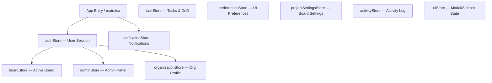
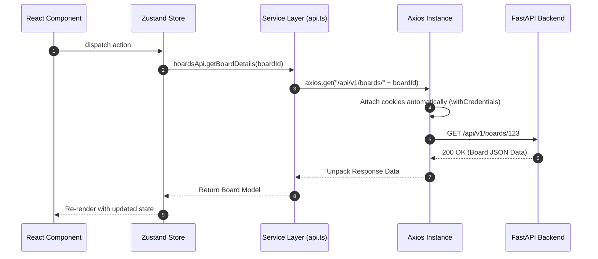

# 03 — Frontend Architecture

## 1. Executive Summary & Tech Stack

The KAIO frontend is a high-performance single-page application (SPA) built using **React 19**, **TypeScript**, and **Vite**.

```
┌─────────────────────────────────────────────────────────────┐
│                         React 19 SPA                        │
├─────────────────────────────────────────────────────────────┤
│   UI Pages & Components ──► Zustand Stores ──► API Services │
├─────────────────────────────────────────────────────────────┤
│                   Axios API Service Client                  │
└─────────────────────────────────────────────────────────────┘
                               │
                               ▼
                    ┌─────────────────────┐
                    │ FastAPI Backend API │
                    └─────────────────────┘
```

### Core Technologies:
- **Framework**: React 19 with TypeScript
- **Build Tool**: Vite v8
- **Styling**: Tailwind CSS v4 (via `@tailwindcss/vite` Vite plugin)
- **State Management**: Zustand v5 (10 stores — no Redux, no React Context for global state)
- **Routing**: React Router DOM v7
- **HTTP Client**: Axios v1 (with httpOnly cookie auth — no manual token attachment)
- **Drag & Drop**: @dnd-kit/core + @dnd-kit/sortable
- **Icons**: Lucide React
- **Toast Notifications**: react-hot-toast
- **Markdown Rendering**: react-markdown + remark-gfm
- **Date Utilities**: date-fns

---

## 2. Directory Structure

```
frontend/src/
├── app/                        # Application root (Router, app entry wiring)
├── assets/                     # Static graphics, SVG icons, logos
├── components/                 # Shared UI primitives across all features
│   ├── common/                 # Reusable modal, dialogs, avatars, project cards
│   │   ├── ConfirmDialog.tsx   # Generic confirmation dialog
│   │   ├── EmptyState.tsx      # Empty state placeholder
│   │   ├── Modal.tsx           # Accessible backdrop modal
│   │   ├── ProjectCard.tsx     # Board/project card preview
│   │   ├── ProjectIdentity.tsx # Board icon + color identity display
│   │   ├── UserAvatar.tsx      # User profile avatar with initials fallback
│   │   ├── WorkspaceLoader.tsx # Full-page loading spinner
│   │   └── WorkspaceLogo.tsx   # Organization logo/branding display
│   ├── layout/                 # Application-level layout shells
│   │   ├── AppLayout.tsx       # Main app shell (sidebar + content area)
│   │   ├── ApplicationSidebar.tsx # Left navigation sidebar
│   │   ├── SettingsLayout.tsx  # Settings page tab layout wrapper
│   │   └── UserAvatarDropdown.tsx # Header avatar menu with logout/settings
│   ├── shared/                 # Domain-shared selector components
│   │   ├── AssigneeSelector.tsx
│   │   ├── DueDatePicker.tsx
│   │   ├── PrioritySelector.tsx
│   │   └── StatusSelector.tsx
│   └── ui/                     # Low-level primitive UI components
│       ├── Button.tsx
│       ├── Card.tsx
│       ├── Skeleton.tsx        # Loading skeleton placeholder
│       └── WidgetError.tsx     # Error state display for dashboard widgets
├── constants/                  # Application constants, route paths, config
├── features/                   # Feature-scoped modules (page + components + hooks)
│   ├── activity/               # Activity log components
│   ├── admin/                  # Superadmin panel (user management, board permissions)
│   │   ├── AdminDashboard.tsx
│   │   ├── AdminLayout.tsx
│   │   ├── BoardPermissions.tsx
│   │   └── UsersManagement.tsx
│   ├── ai/                     # KAI AI agent UI (chat, tools, store)
│   ├── auth/                   # Login, Signup, AcceptInvitation, LandingPage
│   ├── boards/                 # Kanban board feature
│   │   ├── BoardPage.tsx       # Board page wrapper
│   │   ├── components/
│   │   │   ├── KanbanBoard.tsx     # Main board with @dnd-kit drag-and-drop
│   │   │   ├── TaskCard.tsx        # Individual task card preview
│   │   │   ├── AssigneeFilter.tsx  # Board assignee filter bar
│   │   │   └── DueDateFilter.tsx   # Board due date filter bar
│   │   └── modals/
│   │       ├── AddMemberModal.tsx      # Add/invite members to board
│   │       ├── ArchiveProjectDialog.tsx
│   │       ├── CreateTaskModal.tsx
│   │       └── task-details/           # Full task detail modal (comments, attachments)
│   ├── dashboard/              # Manager/Superadmin dashboard
│   │   ├── DashboardPage.tsx
│   │   ├── DashboardView.tsx   # Full dashboard layout, orchestrates widgets
│   │   └── components/         # 9 dashboard widgets:
│   │       ├── KpiCardsRow.tsx             # Org KPI metrics cards
│   │       ├── BoardsOverviewWidget.tsx    # Board completion progress grid
│   │       ├── StrategicProjectsWidget.tsx # Strategic project insights
│   │       ├── FocusTasksWidget.tsx        # Focus task summary
│   │       ├── PendingProposalsWidget.tsx  # Pending AI proposals count
│   │       ├── QuickActionsWidget.tsx      # Quick action shortcuts
│   │       ├── RecentActivityWidget.tsx    # Recent org activity feed
│   │       ├── RecentMeetingsWidget.tsx    # Recent meeting sessions
│   │       └── SmartSuggestionsWidget.tsx  # AI-powered smart suggestions
│   ├── meeting/                # Meeting join controls, active status bar
│   ├── my-work/                # Personal task aggregation view
│   ├── notifications/          # Notification bell, panel, and item components
│   │   ├── NotificationBell.tsx    # Header bell icon with unread badge
│   │   ├── NotificationPanel.tsx   # Slide-in notification list panel
│   │   └── NotificationItem.tsx    # Single notification with deep-link resolver
│   ├── projects/               # Project settings layout & pages
│   │   ├── ProjectSettingsPage.tsx
│   │   └── ProjectSettingsLayout.tsx
│   ├── proposals/              # Task proposal review components
│   ├── settings/               # User & org settings pages
│   │   ├── MyAccount.tsx           # Profile name, avatar, email settings
│   │   ├── Security.tsx            # Active sessions, security event log, password change
│   │   ├── Appearance.tsx          # Theme & UI appearance preferences
│   │   ├── NotificationSettings.tsx
│   │   └── Organization.tsx        # Org profile, invitations management (invite + revoke)
│   └── timesheets/             # Enterprise Timesheet Management Module
│       ├── admin/              # TimesheetAdminPage, TimesheetPolicyForm, ApproverAssignmentManager
│       ├── approvals/          # ApprovalQueuePage, ApprovalQueueSummaryCards, TimesheetReviewModal
│       ├── member/             # MyTimesheetsPage, TimesheetWeekView, TimesheetSummaryBar, TimeEntryRow, Modals
│       └── shared/             # TimesheetErrorBanner, TaskSearchSelector, utils, hooks
├── hooks/                      # Custom React hooks
│   ├── useDebounce.ts
│   └── usePageTitle.ts
├── lib/                        # Axios instance configuration
├── routes/                     # Router configurations & route guards
│   ├── ProtectedRoute.tsx      # Redirects unauthenticated users to /login
│   └── RequireRole.tsx         # RBAC role guard — redirects unauthorized roles to /dashboard
├── services/                   # API call functions wrapping Axios (21 service files: auth, boards, tasks, timesheetService, timesheetApprovalService, timesheetAdminService, timesheetReportsApi, etc.)
├── store/                      # Zustand global state stores
│   ├── authStore.ts            # isAuthenticated, user, login(), logout(), initAuth()
│   ├── boardStore.ts           # Active board metadata
│   ├── taskStore.ts            # Task CRUD, drag-and-drop state
│   ├── adminStore.ts           # Admin user/board management state
│   ├── notificationStore.ts    # Notifications list, unread count
│   ├── organizationStore.ts    # Active organization profile
│   ├── preferencesStore.ts     # User UI preferences
│   ├── projectSettingsStore.ts # Board project settings state
│   ├── activityStore.ts        # Org activity log state
│   └── uiStore.ts              # Global UI flags (modals open, sidebar state)
├── styles/                     # Global CSS & Tailwind v4 customizations
└── utils/                      # Utility helpers
```

---

## 3. State Management — Zustand Stores

The frontend uses **Zustand v5** for all global state — no React Context providers, no Redux.



### Key Stores:
1. **`authStore`**: `isAuthenticated`, `isInitializing`, `user` (id, email, role, organization_id), `login()`, `logout()`, `initAuth()`, `updateUserLocally()`.
2. **`taskStore`**: Task CRUD operations, column state, drag-and-drop position updates, inline editing.
3. **`notificationStore`**: Notification list, unread badge count, mark-read operations.
4. **`adminStore`**: Superadmin user list, board list, role update operations.
5. **`uiStore`**: Global UI flags — open modal IDs, sidebar collapsed state.

---

## 4. Authentication & Protected Routes

Authentication relies on **httpOnly cookie-based JWT** — the frontend never stores or attaches tokens manually. Axios sends cookies automatically via `withCredentials: true`.

### Route Guard Pattern:

```tsx
// src/routes/ProtectedRoute.tsx — auth check
export const ProtectedRoute: React.FC = () => {
  const { isAuthenticated, isInitializing } = useAuthStore();

  if (isInitializing) return <div className="..."><div className="animate-spin ..."></div></div>;
  if (!isAuthenticated) return <Navigate to="/login" replace />;

  return <Outlet />;
};

// src/routes/RequireRole.tsx — RBAC role check
export const RequireRole: React.FC<{ allowedRoles: string[] }> = ({ allowedRoles }) => {
  const { user, isAuthenticated, isInitializing } = useAuthStore();

  const userRole = (user?.role || '').toUpperCase();
  const hasRole = allowedRoles.map(r => r.toUpperCase()).includes(userRole);

  if (!hasRole) return <Navigate to="/dashboard" replace />;
  return <Outlet />;
};
```

**Usage**: Dashboard and Admin pages are wrapped with `<RequireRole allowedRoles={['MANAGER', 'SUPER_ADMIN']}>`.

---

## 5. Frontend API Layer Architecture (`src/services`)

All HTTP communication passes through an **Axios client instance** configured in `src/lib/`:
- **Cookie-based Auth**: No manual `Authorization` header attachment — cookies are sent automatically with every request (`withCredentials: true`).
- **Response Interceptor**: Intercepts `401 Unauthorized` responses and triggers `authStore.logout({ forced: true })` to clear local state and show session-expired toast.
- **17 service files**: `authApi.ts`, `boardsApi.ts`, `tasksApi.ts`, `commentsApi.ts`, `notificationsApi.ts`, `invitationsApi.ts`, `dashboardApi.ts`, `adminApi.ts`, `myWorkApi.ts`, `preferencesApi.ts`, `organizationApi.ts`, `activityApi.ts`, `meetingApi.ts`, `taskProposals.ts`, `projectSettingsApi.ts`, `attachmentsApi.ts`, `usersApi.ts`.



---

## 6. Key UI Modules & Layouts

### 6.1 Kanban Board Feature (`src/features/boards/`)
- **`BoardPage`**: Page wrapper — loads board data, renders header and `KanbanBoard`.
- **`KanbanBoard`**: Main drag-and-drop workspace using `@dnd-kit/core` + `@dnd-kit/sortable`. Renders column containers and task cards, handles optimistic reordering.
- **`TaskCard`**: Individual task card preview — title, assignee avatar, due date, priority badge, comment count. Clicking opens task detail modal.
- **`task-details/`**: Full task detail modal — Markdown description, comment thread, attachment list, inline status/priority/assignee/due date editing.
- **`AddMemberModal`**: Invite members to a board; supports searching by email and assigning board roles.
- **`CreateTaskModal`**: Quick task creation form with title, description, assignee, priority, due date.

### 6.2 Dashboard Feature (`src/features/dashboard/`)
Only accessible to **Manager** and **Superadmin** roles.
- **`DashboardView`**: Orchestrates all 9 widget components. Fetches from `GET /api/v1/dashboard/summary`.
- **`KpiCardsRow`**: Displays top-level KPIs: total tasks, tasks by status (todo/in-progress/review/done), overdue tasks, total boards, team size, pending proposals, active meetings.
- **`BoardsOverviewWidget`**: Per-board progress cards with completion percentage and overdue count.
- **`StrategicProjectsWidget`**: Strategic project card display with visual progress indicators.
- **`RecentActivityWidget`**: Last 10 org activity events with actor names and timestamps.
- **`RecentMeetingsWidget`**: Recent meeting sessions with status badges.
- **`PendingProposalsWidget`**: Count of pending AI task proposals requiring review.
- **`SmartSuggestionsWidget`**: AI-powered workspace recommendations.
- **`QuickActionsWidget`**: Shortcut action buttons for common Manager tasks.
- **`FocusTasksWidget`**: High-priority or overdue tasks needing immediate attention.

### 6.3 Admin Feature (`src/features/admin/`)
Only accessible to **Superadmin** role.
- **`AdminDashboard`**: Admin panel home with navigation to sub-sections.
- **`AdminLayout`**: Layout wrapper for all admin pages.
- **`UsersManagement`**: Full user CRUD — list, create, update role (`MEMBER`/`MANAGER`/`SUPER_ADMIN`), delete.
- **`BoardPermissions`**: Assign/remove users from boards, manage board member roles.

### 6.4 Notification System (`src/features/notifications/`)
- **`NotificationBell`**: Header bell icon with live unread badge count.
- **`NotificationPanel`**: Slide-in panel listing all notifications; includes mark-all-read action.
- **`NotificationItem`**: Single notification entry with destination deep-linking — resolves to specific task modal, board, or proposal queue.

### 6.5 Settings Feature (`src/features/settings/`)
- **`MyAccount`**: Edit first name, last name, avatar. Calls `PATCH /users/me`.
- **`Security`**: Active multi-device sessions list with one-click session revocation; security event audit log (logins, password changes, revocations). Calls `GET /auth/sessions`, `DELETE /auth/sessions/other`, `GET /auth/security-events`.
- **`Appearance`**: Theme (dark/light) and UI layout preference toggles.
- **`NotificationSettings`**: Configure per-channel notification preferences (in-app, email).
- **`Organization`**: Org profile editing (name, logo, branding); invitation management — send new invitations and revoke pending ones.

### 6.6 My Work Feature (`src/features/my-work/`)
- **`MyWorkPage`**: Aggregates tasks assigned to the current user across all organization boards. Supports filtering by due date and sorting.
