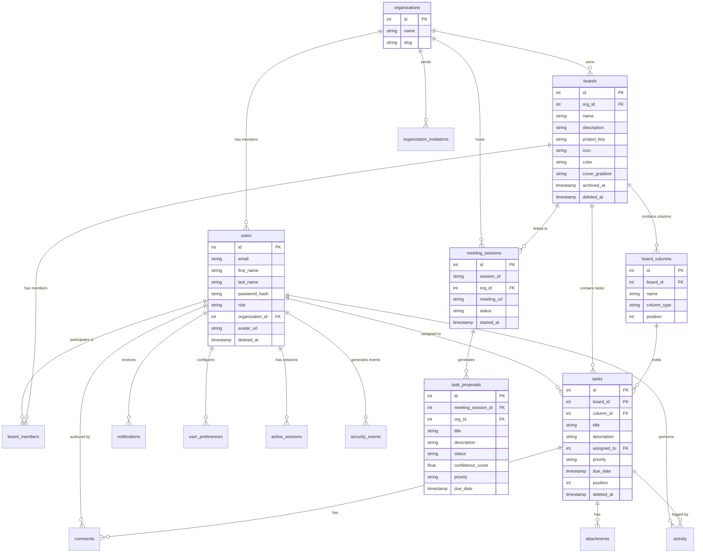

# 04 — Database Architecture

## 1. Executive Summary & Design Principles

KAIO uses **PostgreSQL 15+** as its relational database store. The database layer strictly enforces separation between public interfaces and underlying data tables:

```
┌─────────────────────────────────────────────────────────────┐
│                    Application Layer                        │
├─────────────────────────────────────────────────────────────┤
│  Canonical Views (v_*_canonical) │ Stored Functions (fn_*)  │
├──────────────────────────────────┴──────────────────────────┤
│                  PostgreSQL Schema Tables                   │
└─────────────────────────────────────────────────────────────┘
```

### Key Principles:
1. **Raw SQL Strict Prohibition**: Backend Python code never issues inline `SELECT`, `INSERT`, `UPDATE`, or `DELETE` statements.
2. **Canonical Views (`v_*_canonical`)**: Application code reads exclusively from standardized view layer objects that combine multi-table joins.
3. **Stored Procedure Mutations (`fn_*`)**: All create, update, and delete actions are wrapped in PostgreSQL PL/pgSQL functions.

### Migration Execution:
Migrations live in `database/migrations/` and are applied via `database/scripts/rebuild.py`:
```powershell
# Apply incrementally (no data loss)
python database/scripts/rebuild.py

# Full reset — drops and recreates public schema, then applies all migrations
python database/scripts/rebuild.py --reset
```

---

## 2. Entity-Relationship Diagram (ERD)



---

## 3. Core Database Tables Catalog

| Migration File | Table / Object | Description |
|---|---|---|
| `001_extensions.sql` | Extensions | Enables `uuid-ossp`, `pgcrypto` extensions. |
| `002_enums.sql` | Enums | Enums for `user_role`, `task_priority`, `task_status`, `session_status`. |
| `003_schema_core.sql` | `organizations`, `users`, `boards`, `board_columns`, `board_members`, `tasks`, `comments`, `attachments`, `activity` | Core schema tables for tenancy, authentication, board management, tasks, and audit logs. |
| `004_indexes.sql` | Indexes | Performance indexes on foreign keys, email lookups, task status, column ordering. |
| `005_functions_authz.sql` | Authz Functions | Functions verifying user permissions (`fn_check_board_access`, etc.). |
| `006_functions_mutations.sql` | Mutation Functions | Core mutation functions (`fn_create_task`, `fn_move_task`, `fn_update_task`, etc.). |
| `007_triggers.sql` | Triggers | Updated-at timestamps & automated audit trail triggers. |
| `008_views.sql` | Views | Initial canonical views (`v_users_canonical`, `v_boards_canonical`, `v_tasks_canonical`). |
| `009_seed_data.sql` | Seed Data | Initial development seed data. |
| `010_admin_functions.sql` | Admin Functions | Platform admin management functions. |
| `011_invitation_functions.sql` | `organization_invitations` | Workspace member invitation PL/pgSQL procedures and table. |
| `012_authz_refinements.sql` | Security Updates | Fine-grained access control updates. |
| `013_fix_task_authz.sql` | Security Patch | Authorization bug fixes for task item access. |
| `014_notification_enhancements.sql` | `notifications` | Notification storage table and unread counters. |
| `015_account_security.sql` | Security Tables | Failed login tracking & account lockout constraints. |
| `016_user_preferences.sql` | `user_preferences` | User UI theme, notification channels, & preferences. |
| `017_appearance_updates.sql` | Appearance | Custom UI layout settings. |
| `018_organization_profile.sql` | `organization_profile` | Organization profile metadata & branding options. |
| `019_project_settings.sql` | `project_settings` | Board project configurations (icon, color, key, cover_gradient). |
| `020_update_user_profile.sql` | User Profiles | Extended user profile fields (first_name, last_name, avatar_url). |
| `021_task_proposals_schema.sql` | `task_proposals` | AI-generated action items proposal schema. |
| `022_task_proposals_view.sql` | `v_task_proposals_canonical` | Canonical view aggregating proposal details. |
| `023_task_proposals_functions.sql` | Proposal Functions | Stored functions to create, update, approve (`fn_approve_task_proposal`), and reject proposals. |
| `024_task_proposals_hardening.sql` | Security Hardening | `fn_check_proposal_review_access` permission guard for proposal approval queue. |
| `025_task_proposals_nullable_board.sql` | Board Nullability | Permits meeting proposals prior to board assignment. |
| `026_meeting_sessions_org_scope.sql` | Org Scoping | `org_id` added to `meeting_sessions`; scopes sessions strictly to organization tenants. |
| `027_task_proposals_priority_due_date.sql` | Proposal Metadata | Adds `priority` and `due_date` fields to task proposals. |
| `028_users_email_unique.sql` | Constraints | Case-insensitive unique constraint on email addresses. |
| `029_comment_functions.sql` | Comment Procedures | `fn_create_comment`, `fn_delete_comment` stored functions. |
| `030_activity_logging_enhancements.sql` | Audit Trail | Enhanced activity logging, `v_activities_canonical` view. |
| `031_notification_canonical_enhancements.sql` | Notification Views | `v_notifications_canonical` updated with entity target type and deep-link payloads. |
| `032_revoke_invitation_function.sql` | Invitation Revocation | `revoke_invitation(p_invitation_id, p_org_id)` — deletes pending invitations. |
| `032_seed_techinnovators.sql` | Seed Data | TechInnovators workspace demo dataset (users, boards, tasks, members). |
| `033_seed_latest_meeting.sql` | Seed Data | Latest meeting session transcript & task proposals seed data. |
| `034_security_event_functions.sql` | `security_events` | `fn_log_security_event()` stored function + `v_user_security_events_canonical` view. |
| `035_auth_session_functions.sql` | `active_sessions` | `fn_refresh_session()`, `fn_revoke_session()`, `fn_is_session_revoked()` + `v_user_active_sessions_canonical` view. |
| `036_dashboard_views.sql` | Dashboard Views | `v_dashboard_kpis_canonical` (org KPIs) + `v_dashboard_board_summaries_canonical` (per-board summaries). |
| `037_timesheet_enums.sql` | Timesheet Enums | Defines `timesheet_status_enum`, `timesheet_entry_type_enum`, `timesheet_overtime_policy_enum`, `week_start_day_enum`. |
| `038_timesheet_policy_schema.sql` | `timesheet_policies` | Organization-level timesheet policy settings (standard hours, overtime thresholds, lockouts). |
| `039_timesheet_core_schema.sql` | Core Timesheet Tables | Core schema tables: `timesheets`, `timesheet_entries`, `timesheet_approver_assignments`, `timesheet_audit_logs`. |
| `040_timesheet_indexes.sql` | Indexes | Performance indexes on `user_id`, `org_id`, `week_start_date`, `board_id`, `status`. |
| `041_timesheet_functions.sql` | Timesheet Functions | Stored functions (`fn_create_timesheet`, `fn_upsert_timesheet_entry`, `fn_submit_timesheet`, `fn_approve_timesheet`, `fn_reject_timesheet`, etc.). |
| `042_timesheet_triggers.sql` | Triggers | Updated-at timestamps & automated audit trail triggers for timesheets. |
| `043_timesheet_views.sql` | Canonical Views | `v_timesheets_canonical`, `v_timesheet_entries_canonical`, `v_timesheet_policy_canonical`, `v_timesheet_approver_assignments_canonical`, `v_timesheet_audit_canonical`. |
| `044_timesheet_reports_views.sql` | Report Views | `v_timesheet_org_summary_canonical`, `v_timesheet_board_hours_canonical`, `v_timesheet_member_summary_canonical`. |
| `045_simplify_timesheet_approvers.sql` | Approver Simplification | Simplified approver lookup and active status resolution (`fn_get_eligible_approvers`). |
| `046_enforce_task_assignment_timesheets.sql` | Task Assignment Check | Enforces that task-based time logging is restricted to assigned task owners. |
| `047_fix_rejected_timesheet_status.sql` | Status & Workflow Fix | Fixes status transition rules for rejected/recalled timesheets and resubmission. |

---

## 4. Stored Functions & Views Catalog

### 4.1 Canonical View Layer

| View Name | Source Migration | Description |
|---|---|---|
| `v_users_canonical` | `008_views.sql` | User profile combined with organization role. |
| `v_boards_canonical` | `008_views.sql` | Board details with member counts and task counts. |
| `v_tasks_canonical` | `008_views.sql` | Task attributes combined with assignee details, comment/attachment counts. |
| `v_task_proposals_canonical` | `022_task_proposals_view.sql` | Proposal details with confidence scores and source transcript snippets. |
| `v_notifications_canonical` | `031_*.sql` | Notifications with target entity type and deep-link payload. |
| `v_activities_canonical` | `030_*.sql` | Org-scoped activity log with actor names and action descriptions. |
| `v_user_active_sessions_canonical` | `035_*.sql` | Multi-device active JWT session details (user agent, IP, last active). |
| `v_user_security_events_canonical` | `034_*.sql` | Security audit log of authentication and authorization events. |
| `v_dashboard_kpis_canonical` | `036_*.sql` | Org-wide KPIs: total tasks by status, overdue, boards, team size, pending proposals, active meetings. |
| `v_dashboard_board_summaries_canonical` | `036_*.sql` | Per-board: task count, completed task count, completion %, overdue count, member count. |
| `v_timesheets_canonical` | `043_*.sql` | Timesheet details with submitter metadata, status, total hours, and review info. |
| `v_timesheet_entries_canonical` | `043_*.sql` | Time log entries with board & task titles, entry dates, hours, and overtime flags. |
| `v_timesheet_policy_canonical` | `043_*.sql` | Organization timesheet configuration policy rules. |
| `v_timesheet_approver_assignments_canonical` | `043_*.sql` | Active approver assignments linking managers to submitters/orgs. |
| `v_timesheet_audit_canonical` | `043_*.sql` | Complete audit trail log of timesheet state transitions (submit, approve, reject, recall). |
| `v_timesheet_org_summary_canonical` | `044_*.sql` | Weekly org-wide timesheet submission & compliance summary analytics. |
| `v_timesheet_board_hours_canonical` | `044_*.sql` | Board-level hours logging distribution report. |
| `v_timesheet_member_summary_canonical` | `044_*.sql` | Member-level compliance, logged hours, and submission timeliness metrics. |

### 4.2 Authz & Mutation Functions

| Function | Source Migration | Description |
|---|---|---|
| `fn_check_board_access(user_id, board_id)` | `005_*.sql` | Boolean: does this user have access to this board? |
| `fn_create_task(...)` | `006_*.sql` | Atomically creates a task card and records audit log. |
| `fn_move_task(task_id, new_column_id, new_position)` | `006_*.sql` | Atomically moves task to column and position. |
| `fn_approve_task_proposal(proposal_id, board_id, reviewer_id)` | `023_*.sql` | Converts approved proposal into a Kanban task card. |
| `fn_reject_task_proposal(proposal_id, reviewer_id)` | `023_*.sql` | Marks proposal status as `rejected`. |
| `fn_check_proposal_review_access(user_id, org_id)` | `024_*.sql` | Boolean: is this user a Manager or Superadmin in this org? |
| `fn_check_meeting_initiation_access(user_id, org_id)` | `026_*.sql` | Boolean: is this user authorized to start a meeting? |
| `fn_create_comment(...)` | `029_*.sql` | Creates a comment on a task. |
| `fn_delete_comment(comment_id, user_id)` | `029_*.sql` | Soft-deletes a comment (owner check). |
| `fn_log_security_event(...)` | `034_*.sql` | Logs a security event (login, logout, session revoke, password change). |
| `fn_refresh_session(user_id, token, user_agent, ip)` | `035_*.sql` | Upserts an active session record. |
| `fn_revoke_session(session_id, user_id)` | `035_*.sql` | Marks session as revoked. |
| `fn_is_session_revoked(session_id)` | `035_*.sql` | Returns `true` if session is revoked (called on every authenticated request). |
| `revoke_invitation(p_invitation_id, p_org_id)` | `032_revoke_invitation_function.sql` | Deletes a pending invitation by ID (org-scoped). |
| `fn_create_timesheet(user_id, org_id, week_start_date)` | `041_*.sql` | Creates a draft timesheet record for the specified week. |
| `fn_upsert_timesheet_entry(...)` | `041_*.sql` | Creates or updates a time entry row on a draft timesheet. |
| `fn_delete_timesheet_entry(entry_id, user_id)` | `041_*.sql` | Deletes a specific entry from a draft timesheet. |
| `fn_submit_timesheet(...)` | `041_*.sql` | Submits a draft timesheet for approval and logs audit action. |
| `fn_recall_timesheet(...)` | `041_*.sql` | Recalls a submitted timesheet back to draft status. |
| `fn_approve_timesheet(...)` | `041_*.sql` | Approves a submitted timesheet and locks it. |
| `fn_reject_timesheet(...)` | `041_*.sql` | Rejects a timesheet with mandatory feedback comment, reverting status to draft. |
| `fn_assign_timesheet_approver(...)` | `041_*.sql` | Designates a Manager as an organization approver. |
| `fn_remove_timesheet_approver(...)` | `041_*.sql` | Removes an approver assignment. |
| `fn_upsert_timesheet_policy(...)` | `041_*.sql` | Updates organization timesheet policy settings. |
| `fn_check_timesheet_approver_access(user_id, timesheet_id)` | `041_*.sql` | Boolean: does this user have approver rights for this timesheet? |

---

## 5. Migration Execution & Maintenance

Migrations are SQL files in `database/migrations/` applied alphabetically by `database/scripts/rebuild.py`:

```
001_extensions.sql
002_enums.sql
003_schema_core.sql
004_indexes.sql
005_functions_authz.sql
006_functions_mutations.sql
007_triggers.sql
008_views.sql
009_seed_data.sql
010_admin_functions.sql
011_invitation_functions.sql
012_authz_refinements.sql
013_fix_task_authz.sql
014_notification_enhancements.sql
015_account_security.sql
016_user_preferences.sql
017_appearance_updates.sql
018_organization_profile.sql
019_project_settings.sql
020_update_user_profile.sql
021_task_proposals_schema.sql
022_task_proposals_view.sql
023_task_proposals_functions.sql
024_task_proposals_hardening.sql
025_task_proposals_nullable_board.sql
026_meeting_sessions_org_scope.sql
027_task_proposals_priority_due_date.sql
028_users_email_unique.sql
029_comment_functions.sql
030_activity_logging_enhancements.sql
031_notification_canonical_enhancements.sql
032_revoke_invitation_function.sql
032_seed_techinnovators.sql
033_seed_latest_meeting.sql
034_security_event_functions.sql
035_auth_session_functions.sql
036_dashboard_views.sql
037_timesheet_enums.sql
038_timesheet_policy_schema.sql
039_timesheet_core_schema.sql
040_timesheet_indexes.sql
041_timesheet_functions.sql
042_timesheet_triggers.sql
043_timesheet_views.sql
044_timesheet_reports_views.sql
045_simplify_timesheet_approvers.sql
046_enforce_task_assignment_timesheets.sql
047_fix_rejected_timesheet_status.sql
```

> [!NOTE]
> File `032_revoke_invitation_function.sql` and `032_seed_techinnovators.sql` share the `032_` prefix. They are both applied; the rebuild script sorts alphabetically so `032_revoke_invitation_function.sql` runs before `032_seed_techinnovators.sql`.

