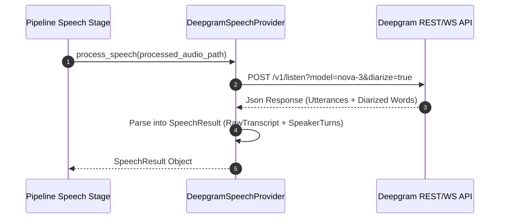
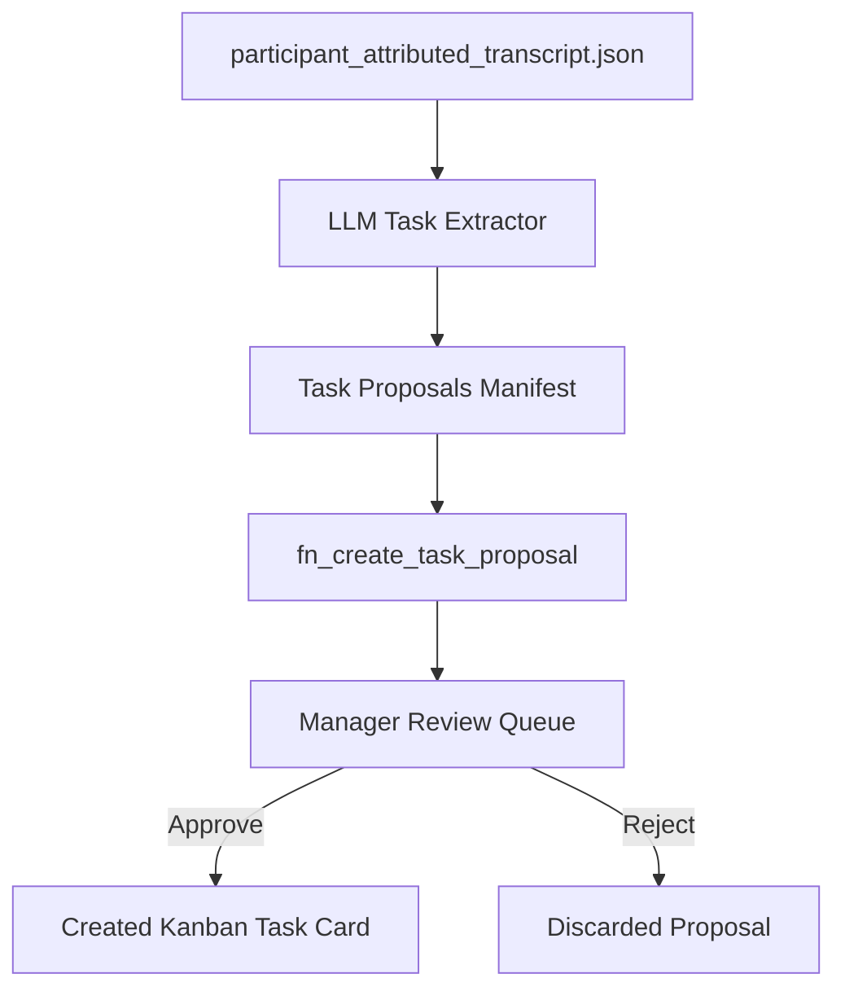

# 06 — AI Architecture

## 1. Executive Summary & AI Strategy

KAIO incorporates AI models across two core operational tiers:
1. **Speech Intelligence Tier**: Cloud-based atomic Speech-to-Text (STT) and speaker diarization via Deepgram Nova-3 API.
2. **Task & Insight Extraction Tier**: Large Language Model (LLM) providers (Puter API, Gemini 1.5/2.0) that extract task proposals, action items, and key decisions from attributed transcripts.
3. **KAI Board Assistant**: Interactive AI agent (`app/ai/agents/`) exposing chat and tool-calling capabilities for board/task operations via `POST /api/v1/ai/chat`.

```
┌─────────────────────────────────────────────────────────────┐
│                    KAIO AI Integration                      │
├──────────────────────────────┬──────────────────────────────┤
│  Deepgram Nova-3 API         │  Puter / Gemini LLM          │
│  (STT + Speaker Diarization) │  (Task Extraction Engine)    │
└──────────────────────────────┴──────────────────────────────┘
```

---

## 2. Speech Intelligence Tier (Deepgram Nova-3)

### Provider Implementation (`app/meeting/providers/speech/deepgram_provider.py`)
- **Engine**: Deepgram Nova-3 cloud model.
- **Parameters**: `model="nova-3"`, `diarize=True`, `smart_format=True`, `utterances=True`.
- **Atomic Diarization**: Receives speech text and speaker turn intervals in a single API call, eliminating latency and boundary drift associated with decoupled diarizers.



---

## 3. LLM Integration Subsystem (`app/ai/`)

### 3.1 Subsystem Layout
- **`agents/`**: Autonomous AI assistant implementations (e.g. KAI board assistant).
- **`providers/`**: LLM gateways (Puter API, Gemini 1.5/2.0 providers).
- **`orchestration/`**: `ClarificationRouter` and intent resolution pipelines.
- **`tools/`**: Function calling tools allowing KAI to perform board, task, and meeting operations.
- **`context/`**: Context builders providing workspace and task state to prompts.
- **`prompts/`**: Prompt templates for task extraction, clarification routing, and decision summaries.
- **`telemetry/`**: Performance tracking, token usage, and response latency telemetry.

### 3.2 Provider Interface (`app/ai/provider.py`, `app/ai/providers/`)
The LLM integration is abstracted to allow runtime switching between providers configured via environment variables:
- **Puter Provider**: Default low-latency LLM gateway (`AI_PROVIDER=puter`, `AI_MODEL=gpt-4o-mini`).
- **Gemini Provider**: Google Gemini API gateway for complex reasoning and large context windows (`AI_PROVIDER=gemini`, `GEMINI_API_KEY=...`).

### 3.3 KAI Board Assistant (`app/ai/agents/`)
- Interactive AI chat agent accessible via `POST /api/v1/ai/chat`.
- Uses function-calling tools (`app/ai/tools/`) to perform board queries, task operations, and meeting lookups.
- Context builders (`app/ai/context/`) inject active workspace and task state into prompts.

---

## 4. Automated Task Extraction & Approval Queue (`app/meeting/pipeline/stages/extraction.py`)

The automated task proposal engine converts completed meeting transcripts into actionable Kanban task proposals:



### Extracted Proposal Schema (`ExtractedTask`):
- `title`: Concise title summarizing the action item.
- `description`: Contextual explanation derived from transcript.
- `suggested_assignee`: Matched participant ID based on speaker attribution.
- `priority`: Suggested priority level (`low`, `medium`, `high`, `urgent`).
- `due_date`: Estimated completion timestamp.
- `confidence_score`: LLM confidence rating (0.0 - 1.0).
- `source_transcript_quote`: Direct timestamped quote supporting task creation.

