# 10 — Code Execution Flow

## 1. Executive Summary

This document contains Mermaid sequence diagrams tracing key user interactions and system execution paths across KAIO.

> [!IMPORTANT]
> All authenticated requests use **httpOnly cookie-based auth**. The `access_token` cookie is automatically sent with every request — no `Authorization` header attachment in the frontend code.

---

## 2. Sequence Diagram 1: User Login Flow (with Cookie Auth & Security Logging)

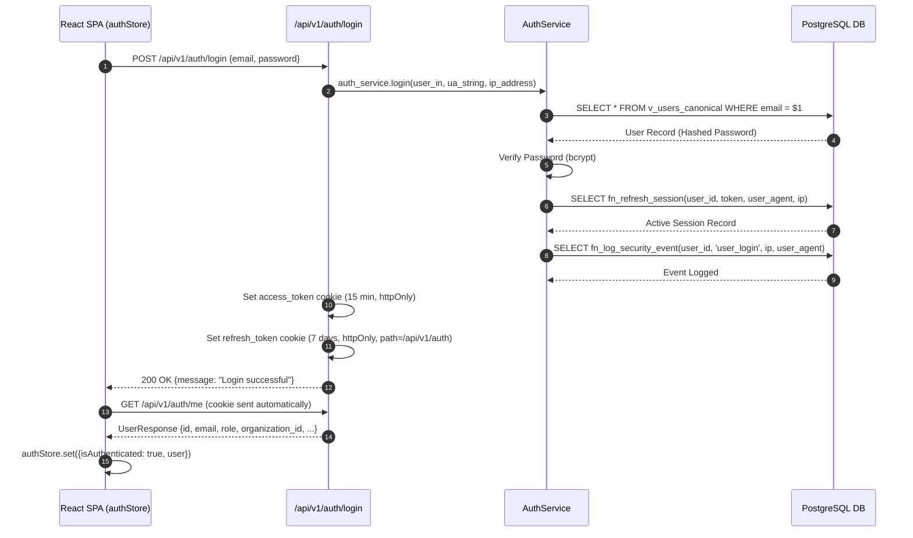

---

## 3. Sequence Diagram 2: Protected Route Access & Session Validation

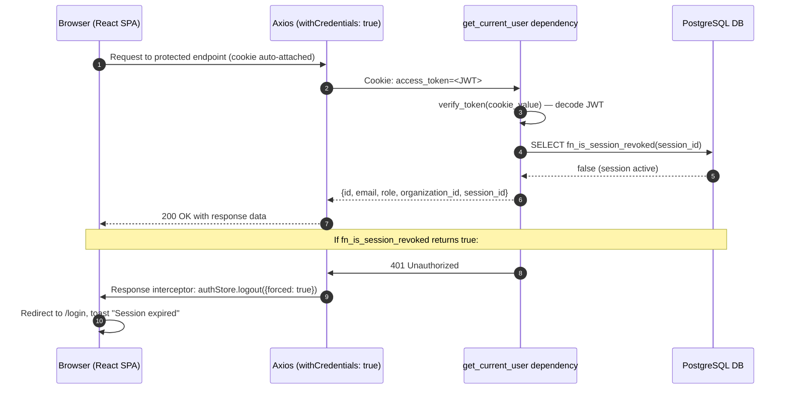

---

## 4. Sequence Diagram 3: Kanban Board Loading & Card Rendering

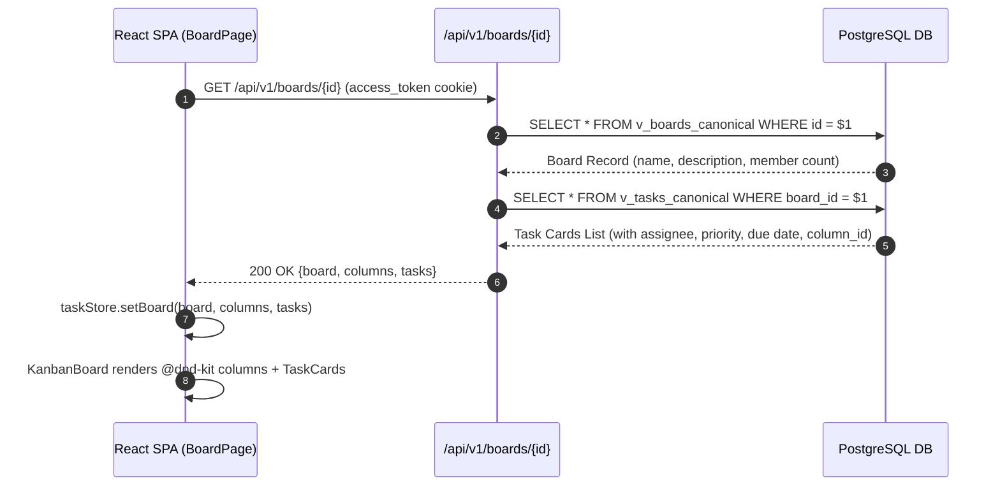

---

## 5. Sequence Diagram 4: Drag-and-Drop Task Move

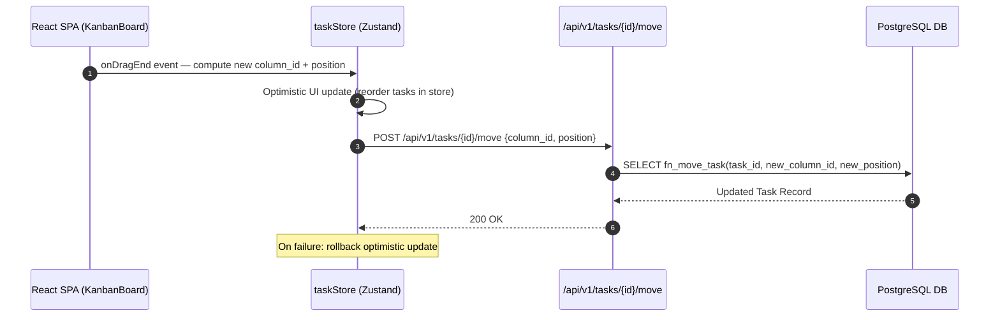

---

## 6. Sequence Diagram 5: Meeting Join & Recording Launch

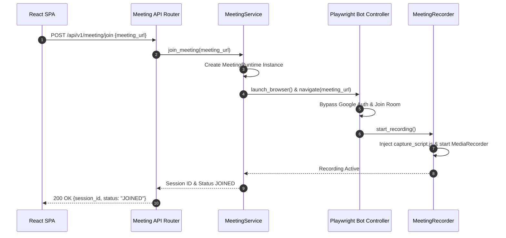

---

## 7. Sequence Diagram 6: Meeting Teardown, Audio Flush & Pipeline Processing

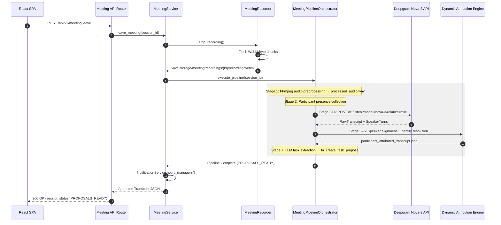

---

## 8. Sequence Diagram 7: AI Task Proposal Approval & Task Creation

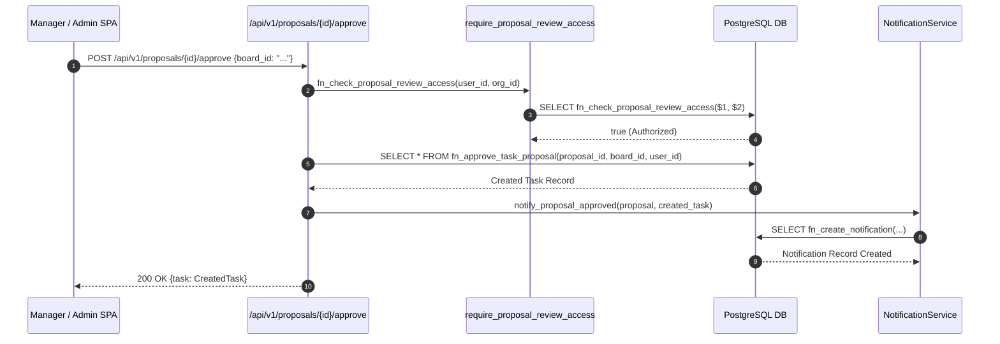

---

## 9. Sequence Diagram 8: Invitation Send & Accept Flow

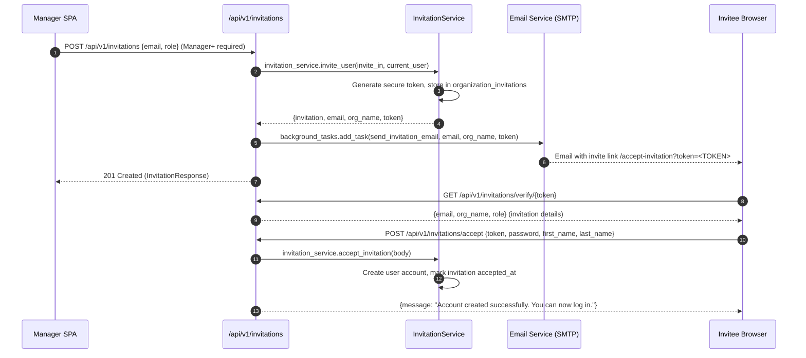

---

## 10. Sequence Diagram 9: Invitation Revocation Flow

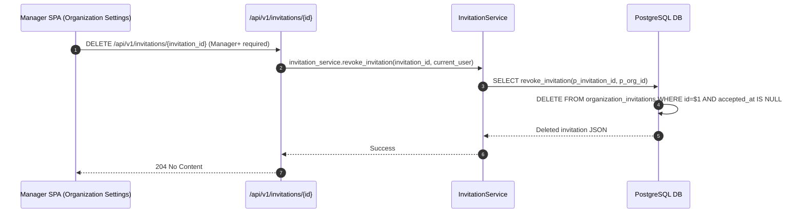

---

## 11. Sequence Diagram 10: Dashboard Data Loading (Manager/Superadmin)

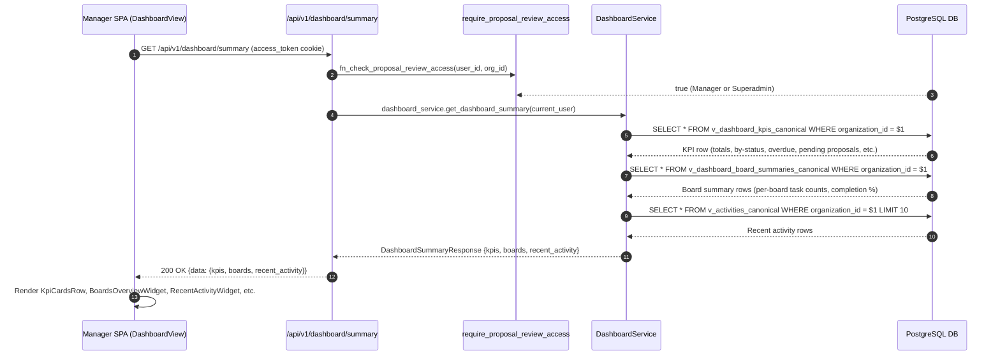

---

## 12. Sequence Diagram 11: Timesheet Submission & Manager Approval Flow

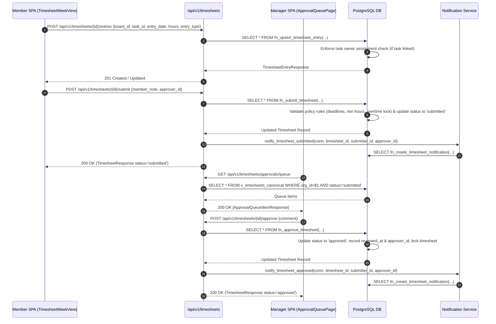

