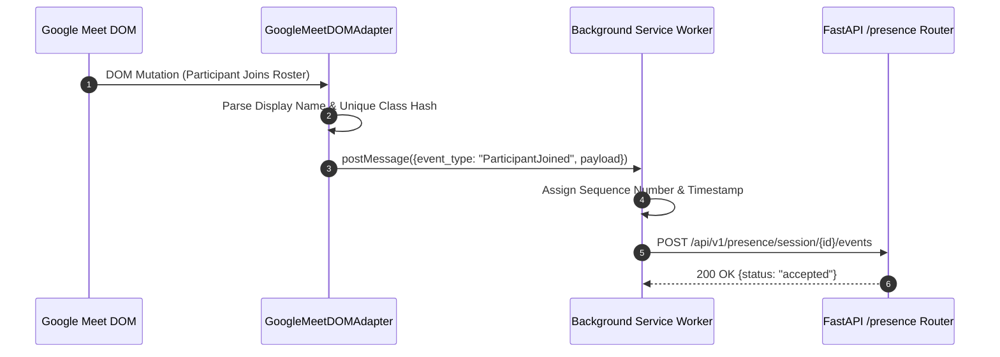

# 13 — Chrome Extension Architecture

## 1. Executive Summary

The **KAIO Presence Integration Extension** (`extension/`) is a Manifest V3 browser extension designed to run alongside Google Meet sessions. It provides real-time DOM observation of participant roster changes and dispatches presence events directly to the KAIO backend (`/api/v1/presence`).

```
┌─────────────────────────────────────────────────────────────┐
│                 Google Meet Page DOM                        │
├─────────────────────────────────────────────────────────────┤
│      GoogleMeetDOMAdapter (MutationObserver)                │
├─────────────────────────────────────────────────────────────┤
│         Background Service Worker (Dispatch Engine)         │
└─────────────────────────────────────────────────────────────┘
                               │
                               ▼
                ┌─────────────────────────────┐
                │ FastAPI /api/v1/presence    │
                └─────────────────────────────┘
```

---

## 2. Directory Structure (`extension/`)

```
extension/
├── manifest.json                       # Manifest V3 setup & permissions
├── background/
│   └── service_worker.js               # Event queuing & HTTP dispatch to backend
├── content/
│   ├── GoogleMeetDOMAdapter.js         # DOM scraping & MutationObserver engine
│   └── meet_observer.js                # Content script initialization & event bus
├── options/
│   ├── options.html                    # Settings UI page
│   └── options.js                      # Configuration persistence
└── shared/
    └── types.js                        # Shared event schemas & constants
```

---

## 3. Extension Component Responsibilities

### 3.1 `manifest.json`
- Configured for Manifest V3.
- Declares permissions: `storage`, `activeTab`, `scripting`.
- Requests host permissions for `https://meet.google.com/*`, `http://127.0.0.1:8000/*`, and `http://localhost:8000/*`.
- Injects content scripts automatically into Google Meet tabs: `shared/types.js`, `content/GoogleMeetDOMAdapter.js`, `content/meet_observer.js`.
- Extension options page is embedded (not opened in a new tab).

### 3.2 `GoogleMeetDOMAdapter.js`
- Uses `MutationObserver` to watch participant roster panels in the Google Meet DOM.
- Detects participant join events, leave events, display name changes, and host badges.
- Emits structured presence payloads to `meet_observer.js`.

### 3.3 `service_worker.js`
- Acts as a background event buffer.
- Maintains HTTP heartbeat connection with KAIO backend `/presence/session/{session_id}/health`.
- Posts presence events (`ParticipantJoined`, `ParticipantLeft`, `ParticipantRenamed`) to `/presence/session/{session_id}/events`.

---

## 4. Sequence Flow: Real-Time Presence Event Dispatch


